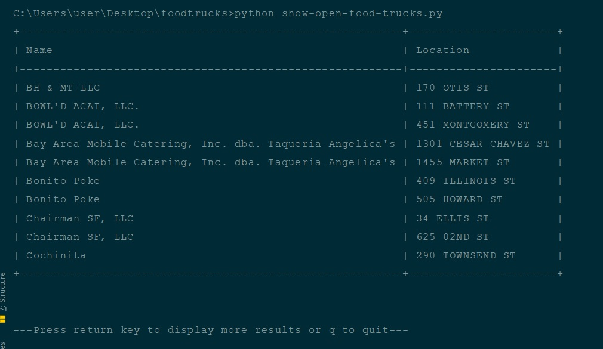

# Show Open Food Trucks
This small utility program makes an API call to the San Francisco government’s website to obtain the required data
and enlist the food trucks which are currently open, along with their locations.

## Contents of the Project
Clone this folder named **foodtrucks**, and save it at any location on your machine. Please make sure that this folder includes:
* _show-open-food-trucks.py_
* _requirements.txt_
* _config.ini_
* _README.md_
* *sample_run.jpg*

## Dependencies
The dependencies have been enlisted in the **requirements.txt** file. Please note that the script was written for
**Python 3.x** version, and therefore, it won't work in case you have **Python 2.x**. Now, in order to install all the
dependencies, `cd` into the **foodtrucks** directory and run the following command:

```pip install -r requirements.txt```

This should install the latest versions of the following Python modules (if they're not already there):
* _colorama_
* _prettytable_
* _requests_
* _getch (for MacOSX)_

## Building the Program
Irrespective of the OS, the script can be run from the terminal or command prompt using the command-line
given below. However, this requires you to cd into the **foodtrucks** directory first.

```python show-open-food-trucks.py```

One way to run it from any location is to provide the full path to the script in the above command, instead of
just the script name. Alternatively, we can make the script executable by using the steps discussed below.

### For Linux-based OS / MacOS
**_Steps_**
1. The shebang has already been added in the script (line 1). It points to the location of the Python interpreter
on your machine. Please make sure that the env variable **PATH** includes Python interpreter's path.
1. `cd` into the **foodtrucks** (if not already there) and run this command to make the script executable:
`chmod +x show-open-food-trucks.py`
1. The final step is to export the path of the script to the **PATH** environment variable. Run the following
sub-steps from the terminal (Replace **.bash_profile** with **.bashrc** if you're using Ubuntu):
    1. `echo 'export PATH=$PATH:/absolute/path/to/the/foodtrucks/directory' >> ~/.bash_profile`
    Don't forget to replace the dummy path in the above command with the real path
    1. Source *.bash_profile* file in order to update the *PATH*:
    `source ~/.bash_profile`
    1. Restart the terminal

Now, you will be able to run the script from any location on your machine using the following command:
`show-open-food-trucks.py`

_**NOTE:**_ There is an alternative to the 3rd step above. Once you make the script executable using the 2nd step,
run the following command to copy the script to the **~/bin** folder:

`sudo cp /path/to/show-open-food-trucks.py ~/bin/show-open-food-trucks`

This lets you run the script from any location by just entering the name of the script (without the extension):

`show-open-food-trucks`

## Example Run
Here is a screenshot showing the output of the script along with the command used to run the script.

